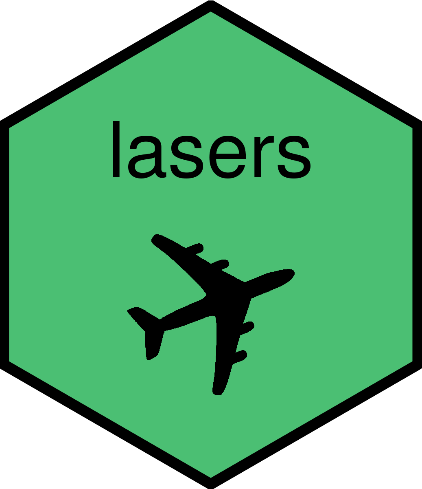

<!-- README.md is generated from README.Rmd. Please edit that file -->

# lasers 

<!-- badges: start -->

[](https://lifecycle.r-lib.org/articles/stages.html#experimental)
[](https://github.com/RobWiederstein/lasers/actions/workflows/R-CMD-check.yaml)
<!-- badges: end -->

The goal of `lasers` is to make the FAA laser incidents data available
in a more user-friendly format. The original data can be found on the
FAA’s website
[here](https://www.faa.gov/about/initiatives/reported-laser-incidents-2022).

## Development Version

You can install the development version with the code below:

``` r
# install.packages("devtools")
devtools::install_github("RobWiederstein/lasers)
```

## Usage

``` r
library(lasers)
head(lasers) |> tibble::tibble()
#> # A tibble: 6 × 9
#>   date_time           flight_id aircraft altitude airport laser_color injury
#>   <dttm>              <chr>     <fct>       <int> <chr>   <fct>       <chr> 
#> 1 2021-01-01 00:48:00 ASH6151   E75L         2000 SAV     green       no    
#> 2 2021-01-01 00:56:00 SKW3321   E75L        17000 ZOA     green       no    
#> 3 2021-01-01 01:02:00 ACO2204   Other        5000 DSM     green       no    
#> 4 2021-01-01 01:25:00 AMF2521   Other        2000 ONT     green       no    
#> 5 2021-01-01 01:40:00 N149MF    Other        4000 ZSE     green       no    
#> 6 2021-01-01 02:15:00 NKS2412   Other        4000 F11     green       no    
#> # … with 2 more variables: city <chr>, state <chr>
```

## Acknowledgements

Many thanks to the following persons, entities and agencies for making
the project possible:

-   The U.S. Federal Aviation Administration

## Code of Conduct

Please note that the lasers project is released with a [Contributor Code
of
Conduct](https://contributor-covenant.org/version/2/1/CODE_OF_CONDUCT.html).
By contributing to this project, you agree to abide by its terms.
